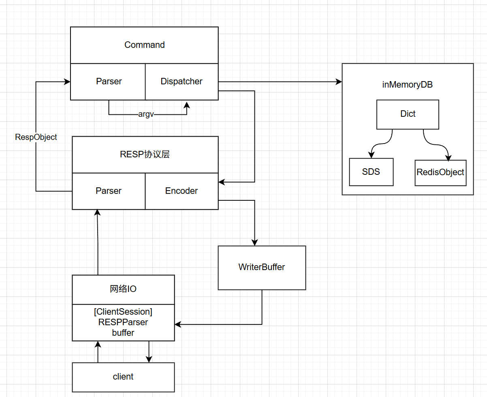

# TinyRedis
## 项目简介
TinyRedis 是一个基于 C++17 实现的 Redis 学习型内核项目，目标是在贴近真实工程的前提下逐步复现 Redis 的核心能力。  
当前版本已打通 `epoll` 单线程事件循环、RESP2 编解码、命令解析与分发链路，并支持 `PING/SET/GET/DEL/EXISTS/INCR` 等基础命令。  
项目重点关注模块化设计与可测试性（`net/protocol/command/core/object` 分层），后续将继续推进 TTL、持久化与稳定性增强。


## 开发环境
- C++17（`g++`/`clang++`）
- CMake >= 3.10
- GTest（`find_package(GTest REQUIRED)`）
- Linux（当前网络层基于 `epoll`）

## 架构设计 
- 分层：`net -> protocol -> command -> db/object -> core`
- 主链路：`Client -> EpollServer -> RESPParser -> CommandParser -> CommandDispatcher -> InMemoryDB`
- 响应链路：`CommandDispatcher -> RESPEncoder -> writeBuf -> Client`
### 架构图




## 目录结构
```text
TinyRedis/
├── CMakeLists.txt
├── main.cpp
├── include/                    # 头文件
│   ├── command/                # 命令解析、分发、DB 接口
│   │   ├── commandDispatcher.hpp
│   │   ├── commandParser.hpp
│   │   └── inMemoryDB.hpp
│   ├── core/                   # 基础数据结构
│   │   ├── dict.hpp
│   │   └── sds.hpp
│   ├── net/                    # 网络与事件循环
│   │   └── epollServer.hpp
│   ├── object/                 # Redis 对象模型
│   │   └── redisObject.hpp
│   └── protocol/               # RESP 协议编解码
│       ├── respEncoder.hpp
│       ├── respObject.hpp
│       └── respParser.hpp
├── src/                        # 源码实现
│   ├── command/
│   │   ├── commandDispatcher.cpp
│   │   ├── commandParser.cpp
│   │   └── inMemoryDB.cpp
│   ├── core/
│   │   ├── dict.cpp
│   │   └── sds.cpp
│   ├── net/
│   │   └── epollServer.cpp
│   ├── object/
│   │   └── redisObject.cpp
│   └── protocol/
│       ├── respEncoder.cpp
│       └── respParser.cpp
├── test/                       # 单元测试
│   ├── test_command.cpp
│   ├── test_dict.cpp
│   ├── test_resp.cpp
│   └── test_sds.cpp
├── docs/                       # 设计文档与路线文档
│   ├── design.md
│   └── roadmap.md
├── conf/                       # 配置样例（预留）
└── build/                      # CMake 构建目录（已在 .gitignore 中忽略）
```

## 快速开始
```bash
cmake -S . -B build
cmake --build build -j
./build/tinyredis
```

## 运行测试
```bash
ctest --test-dir build --output-on-failure
```

## 文档索引
- [设计说明](docs/design.md)
- [Roadmap](docs/roadmap.md)
- 任务拆分与进度跟踪以 GitHub `Issues/Projects` 为主

## 性能摘要
- 当前为功能正确性优先阶段，尚未给出稳定性能基线。
