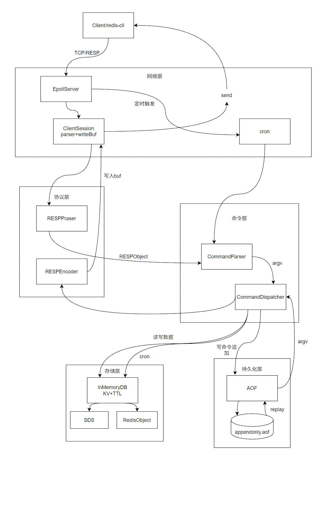

# TinyRedis
## 项目简介
TinyRedis 是一个基于 C++17 实现的 Redis 学习型内核项目，目标是在贴近真实工程的前提下逐步复现 Redis 的核心能力。  
当前版本已打通 `epoll` 单线程事件循环、RESP2 编解码、命令解析与分发链路，并支持 String 基础命令、TTL 命令子集与 AOF 持久化。  
项目重点关注模块化设计与可测试性（`net/protocol/command/core/object/persistentence` 分层），后续将继续推进配置化、稳定性增强与更多数据类型。


## 开发环境
- C++17（`g++`/`clang++`）
- CMake >= 3.10
- GTest（`find_package(GTest REQUIRED)`）
- Linux（当前网络层基于 `epoll`）

## 架构设计

TinyRedis 当前采用单线程 `epoll` 事件循环模型，主请求链路按 `net -> protocol -> command -> storage -> core` 分层。AOF 不在普通读请求主链路上，只在启动恢复和写命令持久化时参与。


- 请求链路：`Client -> EpollServer -> RESPParser -> CommandParser -> CommandDispatcher -> InMemoryDB`
- 响应链路：`CommandDispatcher -> RESPEncoder -> ClientSession::writeBuf -> handleClientWrite -> Client`
- 持久化旁路：AOF 负责写命令追加、启动恢复、同步重写与可配置 fsync 策略
- cron 任务：当前不是独立线程，而是在 `EpollServer::run` 事件循环中周期触发 `CommandDispatcher::cron`

### 架构图



## 当前能力概览
- 已实现命令：`PING/SET/MSET/GET/MGET/DEL/EXISTS/INCR/INCRBY/DECR/EXPIRE/TTL/PTTL/PERSIST/INFO/REWRITEAOF/BGREWRITEAOF`
- 过期策略：惰性过期（访问时检查）+ 主动过期（事件循环周期触发抽样清理）
- 配置：支持配置文件和启动参数设置端口、AOF 开关、AOF 文件路径、`appendfsync` 策略
- 观测：支持 `INFO` 输出 server、clients、stats、persistence、replication 基础指标
- 持久化：AOF（写命令追加 + 启动重放恢复 + 同步 rewrite + `always/everysec/no` fsync 策略）
- 测试基线：`test_sds`、`test_dict`、`test_resp`、`test_config`、`test_command`、`test_aof`、`test_e2e`（已接入 CTest）


## 目录结构
```text
TinyRedis/
├── CMakeLists.txt
├── main.cpp
├── include/                    # 头文件
│   ├── command/                # 命令解析、分发、DB 接口
│   │   ├── commandDispatcher.hpp
│   │   ├── commandParser.hpp
│   │   └── inMemoryDB.hpp
│   ├── config/                 # 配置文件解析与服务配置结构
│   │   └── serverConfig.hpp
│   ├── core/                   # 基础数据结构
│   │   ├── dict.hpp
│   │   └── sds.hpp
│   ├── net/                    # 网络与事件循环
│   │   └── epollServer.hpp
│   ├── object/                 # Redis 对象模型
│   │   └── redisObject.hpp
│   ├── persistentence/         # AOF 持久化模块
│   │   └── aof.hpp
│   └── protocol/               # RESP 协议编解码
│       ├── respEncoder.hpp
│       ├── respObject.hpp
│       └── respParser.hpp
├── src/                        # 源码实现
│   ├── command/
│   │   ├── commandDispatcher.cpp
│   │   ├── commandParser.cpp
│   │   └── inMemoryDB.cpp
│   ├── config/
│   │   └── serverConfig.cpp
│   ├── core/
│   │   ├── dict.cpp
│   │   └── sds.cpp
│   ├── net/
│   │   └── epollServer.cpp
│   ├── object/
│   │   └── redisObject.cpp
│   ├── persistentence/
│   │   └── aof.cpp
│   └── protocol/
│       ├── respEncoder.cpp
│       └── respParser.cpp
├── test/                       # 单元测试
│   ├── test_aof.cpp
│   ├── test_command.cpp
│   ├── test_config.cpp
│   ├── test_dict.cpp
│   ├── test_e2e.cpp
│   ├── test_resp.cpp
│   └── test_sds.cpp
├── docs/                       # 设计文档与路线文档
│   ├── assets/
│   │   ├── tinyredis.png
│   │   └── v0.1.png
│   ├── design.md
│   └── roadmap.md
├── conf/                       # 配置样例
│   └── tinyredis.conf
└── build/                      # CMake 构建目录（已在 .gitignore 中忽略）
```

## 快速开始
```bash
cmake -S . -B build
cmake --build build -j
./build/tinyredis
```

默认监听 `127.0.0.1:6379`，也可以通过第一个参数指定端口：

```bash
./build/tinyredis 6380
```

也可以使用配置文件：

```bash
./build/tinyredis --config conf/tinyredis.conf
./build/tinyredis --config conf/tinyredis.conf --port 6380
```

当前支持的配置项：

```conf
port 6379
appendonly yes
appendfilename appendonly.aof
appendfsync everysec
```

## 运行测试
```bash
ctest --test-dir build --output-on-failure
```

## 文档索引
- [设计说明](docs/design.md)
- 任务拆分与进度跟踪以 GitHub `Issues/Projects` 为主

## 性能摘要
- 当前为功能正确性优先阶段，尚未给出稳定性能基线。
